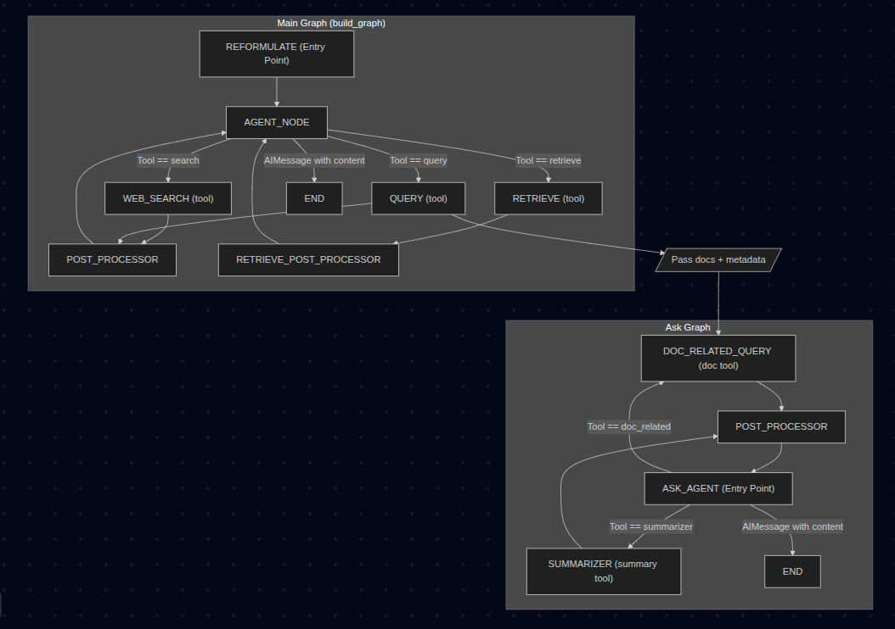

# SoulPage Assignment

## Steps to Run the Project

1. **Create a virtual environment** (Ubuntu specific)
   `python -m venv venv`

2. **Activate the environment** (Ubuntu specific)
   `source venv/bin/activate`

3. **Install the packages**
   `pip install -r requirements.txt`

4. **Add the Tavily API Key as environment variable**
   In your .env place "TAVILY_API_KEY=tvly-......"
   
5. **Run the app**
   `uvicorn main:app --port 8000 --host localhost`

6. **Run the Streamlit UI**
   `streamlit run app.py`

---

## Exposed APIs

There are **3 APIs** exposed:

1. **Upload File** – Upload documents to a user-specific knowledge base.

   * **Endpoint:** `POST /upload`
   * **Takes:** `knowledge_name` (str), `user_id` (str), list of files (`UploadFile[]`)
   * **Returns:** `{ "status": "success", "files": [...] }` containing upload results.

2. **Index File** – Convert uploaded documents into embeddings and store them for retrieval.

   * **Endpoint:** `POST /index-file`
   * **Takes:** `knowledge_name` (str), `user_id` (str)
   * **Returns:** `{ "status": "indexed", "pages": <count> }` or similar metadata.

3. **Ask** – Query the indexed knowledge using LLM + vector retrieval.

   * **Endpoint:** `POST /ask`
   * **Takes:** `knowledge_name` (str), `user_id` (str), `query` (str)
   * **Returns:** `string` – The final answer generated by the orchestrator agent.

---

## 1st Task — Deliverables Checklist

1. **Create two LangChain or LangGraph agents**

   * Each agent has a specific role and tool access. ✔️ *Done*

2. **Implement a controller/orchestrator agent** that triggers both and merges responses. ✔️ *Done*

   * The main agent is the controller, the ask agent is secondary.

3. **Maintain context and memory between agent calls**. ✔️ *Done*

   * Implemented `reformulate_Question` for history-aware reformulation.

4. **Optional:** Streamlit UI to interact with orchestrator agent. ✔️ *Done*

   * Implemented `app.py`.

---

## 2nd Task — Deliverables Checklist

1. Use LangChain’s memory system with ConversationChain/AgentExecutor. ✔️ *Done*

   * Conversation stored directly into Postgres.

2. Add a web‑search tool. ✔️ *Done*

   * Implemented `search_tool` (Tavily).

3. Ensure bot capabilities:

   * **Answer factual queries** (e.g., CEO of OpenAI). ✔️ Done
   * **Continue conversation with context** (e.g., "Where did he study?"). ✔️ Done

4. Deploy locally via Streamlit/CLI. ✔️ *Done*

   * `app.py` serves as UI.

---

## Architecture Diagram
Below is a simple architecture diagram representing the workflow of the system:

## Demo Video

[https://drive.google.com/file/d/1Y0QuQbEGf2SGiY_VDFaw8xrKR3ZQDbq7/view?usp=sharing](https://drive.google.com/file/d/1Y0QuQbEGf2SGiY_VDFaw8xrKR3ZQDbq7/view?usp=sharing)
